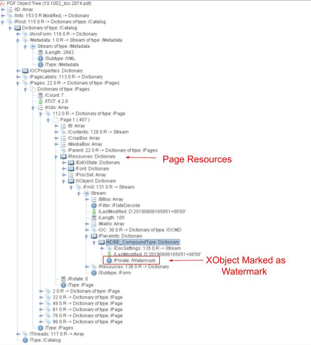
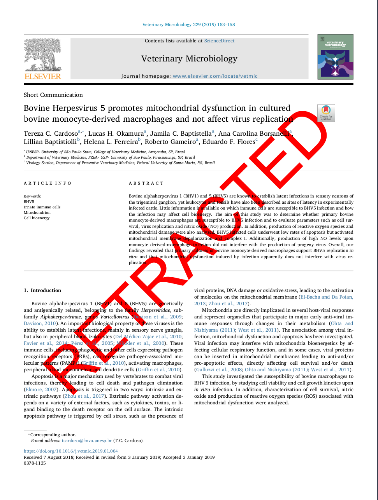
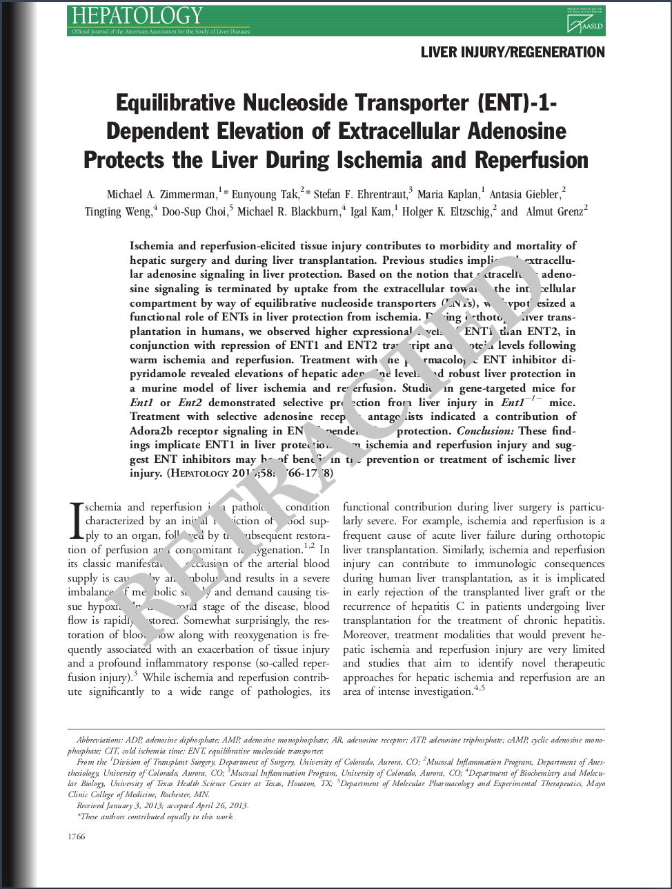

# PDF Watermark Remover

**Removes 'RETRACTED' watermarks from Academic PDF articles.**

This software has three levels of aggressivity; as higher the level more damage it can cause to the final result.\
However, even for the maximum level of aggressivity, the images/photos embedded in the PDF would still be preserved. 
  

-- **Level 1:**
    All PDF stream resources that explicitly contain the information saying that it is a Watermark are removed.

-- **Level 2 (Default):**
    All Watermarks from level 1 and graphical element that appear more than once along the PDF pages are removed.
    In addition, all 'RETRACTED' words are also removed.
    For some few PDFs, this aggressivity level could remove the entire text from a Page.

-- **Level 3:**
    All Watermarks from levels 1 and 2 and all graphical elements are removed from the PDF.
    The only chance for the Retraction Watermark not to be removed with such a level of aggressivity is either the PDF is corrupted or the Retraction Watermark embedded as an Image File.
    In this case, we will preserve the Watermark since this function is designed not to erase any image/photo from the PDF.


### Quick Start

Environment used to run the project:

- Python >= 3.8
- PyPDF4, PyMuPDF

There is a requirements.txt that can help with the environment.
``` bash
$ pip install -f requirements.txt
```

### Usage

Run Watermark remover
``` bash
$ python PDFSolvent -i <PDF-input> -o <PDF-output> -m [mode of aggressivity] 
```


## Cases of Success


### 1: The Watermark is explicit informed in each Page-Resource-XObject field:



Using [RUPS](https://itextpdf.com/en/blog/technical-notes/rups-looking-inside-your-pdfs) from IText©

-------

### 2:  The Watermark is a word that overlays the PDF body Text:

 

**SOURCE** : https://doi.org/10.1016/j.vetmic.2019.01.004

```
% Content Stream of PDF above
% the RETRACTED mark using text operations 
BT
/TT0 1 Tf
0 Tc
0 Tw
0 Ts
100 Tz
0 Tr
72 0 0 72 0 -72 Tm
(RETRACTED) Tj
ET
   
```
-------
### 3. The Watermark is generated by Graphic Path Construction

 

**SOURCE** : https://doi.org/10.1002/hep.26505

```
% Content Stream of PDF above
% There isn't any Xobject related to the watermark, it is written by a set of graphical PDF istructions
stream
/Figure BMC
q
1 0 0 1 22.5352 -66.9826 cm
0 0 595.276 841.89 re
W
n
/GS4 gs
1 0 0 1 80.9177 327.6761 cm
0 0 0 0.25 k
0 0 m
-1.326 1.526 -2.462 2.332 -3.406 2.418 c
....
h
f
EMC
Q
endstream
```

----

## Case of Failure

A case of failure occurs when the PDF is corrupted, and the 'RETRACTED' word is split into subwords along the PDF stream.

For this case, we recommend to download another version of the article and try again.

 

**SOURCE** : https://doi.org/10.1016/S0022-2275(20)30277-7

```
% Content Stream of PDF above
% The PDF is not well organized, and the watermark is not explicit inform in the Resources
% The following stack of instruction are outside of a 'q' 'Q' sequence
% The 'RETRACTED' word is splited in many subwords (RET),(RA),(CTED)

stream
BT
/CS1 cs
1 0 0 scn
1 i
/GS3 gs
/T1_6 1 Tf
61.0339 28.6974 -28.698 61.035 131.1588 287.8868 Tm
(RET) Tj
1.9802 -0.0003 Td
(RA) Tj
1.4071 -0.0003 Td
(CTED) Tj
-3.3847 0.0003 Td
(RET) Tj
1.9806 0.0004 Td
(RA) Tj
1.4071 -0.0003 Td
(CTED) Tj
ET
endstream
```


##### AUTHOR

João Phillipe Cardenuto,

```
				 UNICAMP (University of Campinas) RECOD Lab
```
