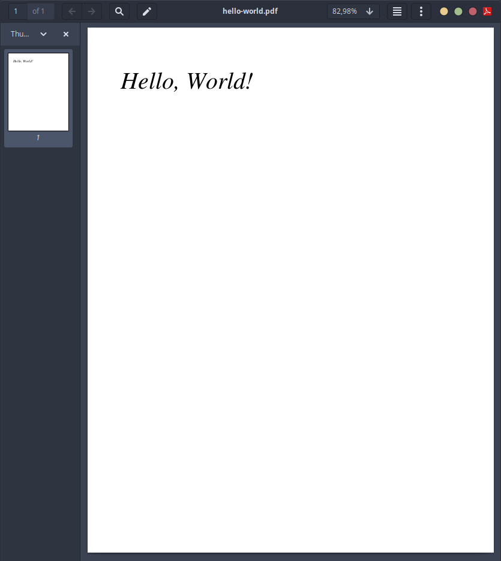
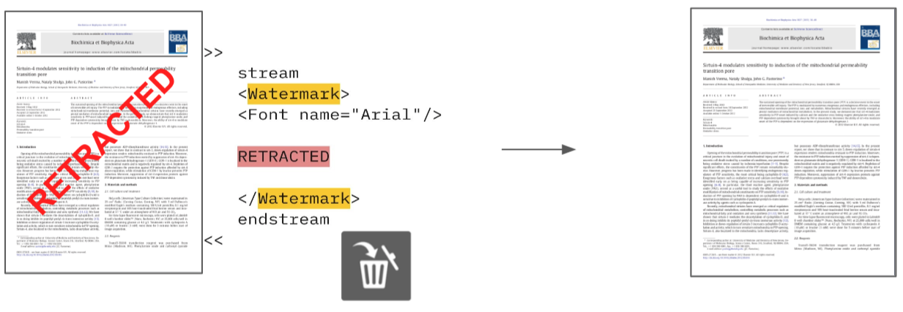
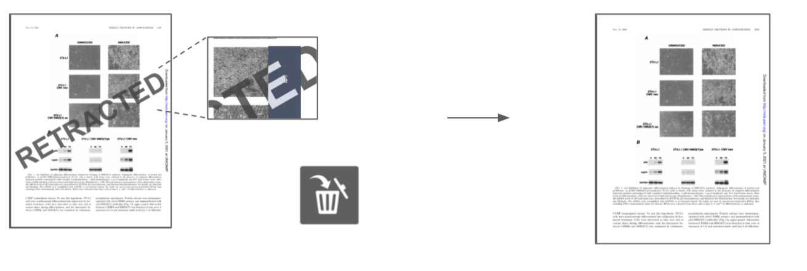
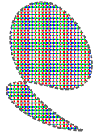
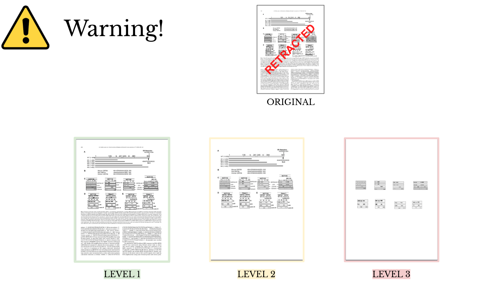

# PDF Retraction Mark Removal


# Basic Concepts

Before presenting how the PDF Retraction Mark works, this section will present some high-level basic concepts of a PDF document.


The Portable Document Format (PDF) is a language for describing a document page. In this sense, a PDF document essentially is a set of instructions showing how the document is rasterized (converted to pixels) [1]. 

Thus, when opening a PDF document by [Adobe Reader](https://www.adobe.com/acrobat/pdf-reader.html)© or [Evince](https://wiki.gnome.org/Apps/Evince), actually, the software is reading instructions from the PDF and rendering (printing) an image in the screen according to these instructions.  These instructions could be associated with font definitions, vector and bitmap graphics, navigation (such as hyperlinks and bookmarks), and interactive forms [1].

For example, the next code extracted from Whitington's book [1] is the source of the PDF rendered in Figure 1.

```PDF
# hello-world.pdf -- Code extracted from Whitington's Book [1]
%PDF-1.1
1 0 obj 
<< /Type /Pages
   /Count 1
   /Kids [2 0 R] 
>>
endobj 
2 0 obj 
<< /Type /Page
   /MediaBox [0 0 612 792]
   /Resources 3 0 R
   /Parent 1 0 R
   /Contents [4 0 R]
>>
endobj 
3 0 obj 
<< /Font 
     << /F0 
          << /Type /Font
             /BaseFont /Times-Italic
             /Subtype /Type1 >>
     >>
>>
endobj 
4 0 obj 
<< >>
stream
1. 0. 0. 1. 50. 700. cm
BT
  /F0 36. Tf
  (Hello, World!) Tj
ET 
endstream 
endobj 
5 0 obj 
<< /Type /Catalog
   /Pages 1 0 R
>>
endobj xref
0 6
trailer
<< /Size 6
   /Root 5 0 R
>>
startxref
0
%%EOF

```

CODE 1:  PDF code for printing "hello world"



FIGURE 1: Screenshot of a rendered PDF using the code hello-world.pdf.


# Removing PDF Retraction Marks

Retraction marks essentially are included in a PDF by three types of PDF instructions:

1- Watermarks

2- Texts instructions

3- Graphical Element instructions


<div style="text-align: left">  <strong>1-Watermarks</strong></div>


Whenever a Retraction Mark is included in a PDF, its command will have the following format:

```
stream
<watermark>
# other instructions
</watermark>
endstream
```

Therefore, by detecting and removing the piece of code within the \<watermark> instructions, we remove it from the PDF



Figure 2: Remove Retraction Marks that are represented with Watermark instructions in the PDF stream.

----


<div style="text-align: left">  <strong>2-Texts Instructions</strong></div>

Another type of retraction marks are Text instructions, exemplified by CODE-2.

```
% the RETRACTED mark using text operations 
BT
/TT0 1 Tf
0 Tc
0 Tw
0 Ts
100 Tz
0 Tr
72 0 0 72 0 -72 Tm
(RETRACTED) Tj  # We remove this instruction to remove the 'RETRACTED' mark
ET
   
```

CODE 2:  Text instruction of a "RETRACTED" mark.

To remove this type of retraction mark, we simply delete all "RETRACTED" words from the PDF, by removing the instruction that would make a PDF software render it. 


Figure 3 shows the result of redacting the text instruction of the PDF, removing its retraction mark



Figure 3:  Result of removing the "RETRACTED" word from the PDF instructions.


-----


<div style="text-align: left">  <strong>3-Graphical Instructions</strong></div>

The last type of retraction marks instructions embedded in PDF documents are Graphical Instructions.

Just as vector images, graphical elements are a set of instructions that software would lead to rendering an image. These instructions have the following format:

```
stream
100 100 m 300 200 l 700 100 l 
endstream
endobj
```

which would be interpreted as:

```
Make a line moving a point from position (100,100) to (300,200), than from (300,200) to (700,100)	
```


Such instructions can become as complex as the code for rendering graphs, molecular structures, and RETRACTED marks.

Since we can't easily distinguish whether a code refers to a molecular structure or a RETRACTED mark --due to its complex instructions--, we remove all graphical elements from the PDF to assert that the RETRACTED mark is removed. Unfortunately, this can cause a side effect of removing other graphical elements from the PDF.

 Note, however, that JPG, PNG, and any other figure are not embedded in the PDF as graphical instructions so that this solution won't delete them.


Figure 4:  Result of removing graphical elements from the PDF instructions.


----



Figure 5: Result of removing the "RETRACTED" mark using the implemented  solution.  From left to right, Level 1 applies the "RETRACTION" mark removal by removing instructions of watermark; Level 2 applies the watermark solution and also remove the 'RETRACTED' texts from the PDF instructions; Level 3 applies all previous solutions and also remove all graphical elements instructions from the PDF ( note that figures won't be excluded from the PDF).


***To avoid deleting the other structures from the PDF  --by the side effects of the solution--, make sure to select the appropriate solution level in order to remove the "RETRACTED mark.***


Figure 5 shows the implemented solutions.

-- **Level 1:** All PDF instructions that are relative of watermarks are removed.

-- **Level 2 (Default):**  Watermarks from level 1 and  'RETRACTED' words are also removed. For some few PDFs, this level could remove the entire text from a Page.

-- **Level 3:**  All previous removal levels are applied, and also all graphical elements instructions are removed from the PDF . The only chance for the Retraction Watermark not to be removed with this level is either the PDF is corrupted or the Retraction Watermark embedded as an Image File. If we are in the last case, we will preserve the Watermark since this function is designed to not erase any image/photo from the PDF.


# References

[1]  Whitington, John. *PDF Explained*. O'Reilly Media, 2012. 

